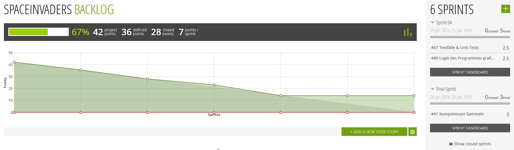

Teamwork
========
Alain Keller, Pascal Honegger und Seraphin Rihm
Version 1.3, 25.01.2016
:toc:

== 29.12.2015 Problem Invader | Player
Pascal und Seraphin sassen vor dem Probelm, dass unser Invader und der Spieler beide von der selben abstrakten Klasse (ShipBase) ableiten. Der Spieler und der Invader werden intern beide gleich als IShip behandelt. Um redundaten Code zu verhindern, haben wir die abstrakte Klasse erstellt und dort beispielsweise die Methode 'Move()' implementiert. Um die Klassen Ship & Invader voneinander zu unterscheiden, realisierten der Spieler das IPlayer-Interface und der Invader noch ein IInvader-Interface. Dies gab jedoch Probleme und eine Klasse implementierte das IShip-Interface mehrmals => etwas war falsch. Nach einer Diskusion kame wir zur Schlussfolgerung, dass es den IPlayer und IInvader nicht mehr braucht. Diese bieden Interfaces hatten beinahe keinen Inhalt und sorgten nur dafür, dass ein Spieler von einem Invader unterschieden werden konnte. Da nun der Spieler und der Invader beide ein normales IShip sind, sind diese nicht mehr zu unterscheiden. Dies müssen wir aber können, da Invader beispielsweise mit ihren schüssen andere Invader nicht verletzen. Die Lösung auf dieses Problem: ShipType. Dieser neu erstellte Enum wurde dem IShip-Interface hinzugefügt und sagt aus, ob ein Schiff ein Player, Invader oder Boss ist. Mit dieser Implementation sollte alle unsere Probleme gelöst sein.

== 05.01.2015 SRP - Single Responsibility Principle
Nachdem Pascal und Seraphin den Vorschlag bezüglich des Spielers / Invaders gelöst hatten, entschieden wir uns trotzdem als Team die Lösung zu überdenken. Wir wollte dabei nicht die Implementation überarbeiten, da wir nicht mehr viel Zeit für das Projekt hatten. Stattdessen wollten wir einfach herausfinde, ob es eine bessere Implementation gäbe. Nach kurzer Analyse des nun übergrossen IShip-Interfaces viel uns direkt auf, dass wir nicht mehr nach dem SRP arbeiten. Das IShip-Interface ist sowohl für Spieler als auch für den Invader und den zukünftigen Boss verantwortlich. Dabei enthält dieses auch beispielsweise Spieler-spezifische Eigenschaften, welche beim Boss und Invader einfach nicht oder nur mangelhaft implementiert werden. Nach längerem Überlegen sind wir zum Schluss gekommen, dass ein ISpaceInvadersObject interface die beste lösung gewesen wäre. Dieses Interface sorgt für die nötige Implementation von Move(), Texturen und der Unterstützung für das Koordinatensystem.

== 05.01.2015 Evolvierbarkeit
Wie oben schon erwähnt entschieden wir uns nicht nach dem SRP zu implementieren, da der Aufwand des refactoing zu gross gewesen wäre. Dadurch mussten wir auch einen Kompromiss in der Evolvierbrkeit unseres codes eingehen. Viele Aufgaben werden in einer Klasse gelöst, und es besteht auch keine lose koppelung zwischen View und Viewmodel. Diese lose Koppelung zu erreichen wäre ein zu grosser Aufwand für unsere restliche Zeit. Dazu wären Events nötig, doch diese sind in unsere Implementation zu sehr gebunden und machen auch weniger Sinn als erwartet. 

== Was haben wir gelernt?

Am meisten Probleme hatten wir bei der Architektur und der Implementation. Obwohl wir das Gefühl hatten alles durchdacht zu haben, standen wir bei der Implemenation immer wieder vor Überlegungsfehler in der Architektur. Am mesisten haben wir das SRP vernachlässigt. Während dem erstellen der Architektur haben wir uns viel zu wenig gedanken über verantwortlichkeiten der einzelnen Klassen gemacht. Das haben wir dann erst beim Implemetieren gemerkt. Die teils fehlende Architektur hat sicher damit zu tun, dass wir zu viel Zeit für den Basic-Test gebraucht haben. Das nächste Mal müssen wir uns mehr Gedanken darüber machen, wie viel Zeit wir für unseres Projekt haben, und wie viel wir benötigen. 

Bei der Implementation haben wir auch gemerkt, dass unser Gui-Framework nicht sehr für unseres Projekt geeignet ist. Wir hatten vor das Spiel mit WPF zu realisieren, doch ein Framework, welches für Games/Animationen gemacht ist, wäre um einiges Sinnvoller gewesen. Die Unity-Engine wäre z.B. geeigneter gewesen.

== Tipps

=== VCS - Git
In unserem Projekt haben wir das Versionsverwaltungssystem link:https://git-scm.com/[Git] verwendet. Dieses hat den Vorteil ,dass mehrere Personen an der selben Datei arbeiten können, ohne voneinander abhängig zu sein. Auch ein grosser Vorteil von Git ist link:https://github.com/[Github], welches wir als kostenlosen Git-Server verwenden können. Um mit Github arbeiten zu können, braucht man lediglich eine Git-Installation und einen gratis Github-Account. Um Git konfortabler benutzen zu können, kann man auch die Github-Erweiterung für die jeweilige IDE installieren.

==== Commits
Mithilfe von Commits kann man jederzeit in der Zeit zurückreisen und sich ansehen, wer was bearbeitet hat.
image:Bilder/github.jpg[Git Commits]

==== Diff
Mithilfe von Git kann man einen sogenannten Diff (Difference) einsehen. In diesem kann man genau sehen, welche Zeilen sich verändert haben. So kann man sogenannte Reviews durchführen und die Code-Qualität zu erhöhen.
image:Bilder/gitdiff.jpg[Vergleich von Dateien]

=== UMLet & Asciidoc
Git ist wirklich gut darin, Textdateien zu verwalten. Verwendet man nun beispielsweise Wrod oder Visio-Dateien, verliert git an Wert. link:http://asciidoc.org/[Asciidoc] Ist beispielsweise ein rein textbasierte Art um ein Dokument zu gestallten. So schreibt man sozusagen Code, welcher danach in ein GTML oder ähnliches "kompiliert" werden kann. Genauso können via link:http://www.umlet.com/[UMLet] UML-Diagramme codiert werden. Am Anfang ist es nützlich ein Cheatsheet zu verwenden, um den Syntax möglichst schnell zu erlernen. 

=== UML-Diagramme auf Papier
Was uns wirklich viel Zeit gespart hat, war die UML-Diagramme auf Papier zu zeichnen. Später können diese immernoch in Visio / UMLet nachgeführt werden, doch die initiale Version zu erstellen lohnt sich auf Papier viel mehr. Auf Papier investiert man weniger Zeit in das Tool und mehr Zeit in die Erstellung des Diagrammes! 

=== Scrum - Taiga
Damit die Arbeit mit Git möglichst effizient von statten gehen konnte, mussten wir unsere Arbeit möglichst effizient aufteilen. Hierfür haben wir uns nicht für IPERKA sonder für eine Agile Arbeitsmethode namens Scrum entschieden. Bei Scrum plant man täglich, was man erreichen mlchte und teilt dieses Wissen mit den anderen Teammitgliedern. Dadurch weiss jeder, was der ander an diesem Tag machen möchte und kann seine Arebti an dies anpassen. Diese Planung haltet man in einem Scrum-Board fest - hierfür haben wir den Gratis-Dienst link:https://tree.taiga.io/[Taiga] verwendet.

=== Continous Integration
Auch wenn es viel Zeit beim ersten Aufsetzen frisst, lohnt sich die sogenannte Continous Integration (kurz CI) allemal. Eine CI sorgt grundsätzlich dafür, dass bei jeden Git-Push (heraufladen auf Server) auf einer externen Testmaschine der Code auf Fehler überprüft wird. Diese informiert dann beispielsweise den Ersteller des Fehler mit einer E-Mail. Wir haben die Gratis C#-CI link:https://www.appveyor.com/[AppVeyor] welche mit Github funktioniert. Der grosse vorteil dieser CI ist, dass sie keine zwei Minuten zum Aufsetzen benötigt. Trotzdem macht eine CI nur Sinn, wenn die Applikation über genügend Unit-Tests verfügt!
image:Bilder/appveyor.jpg[Auswerung der CI]