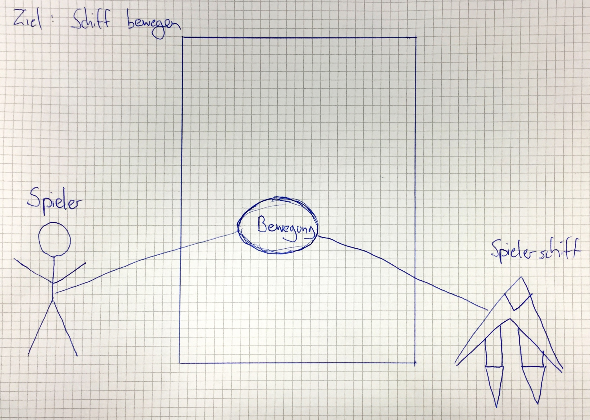
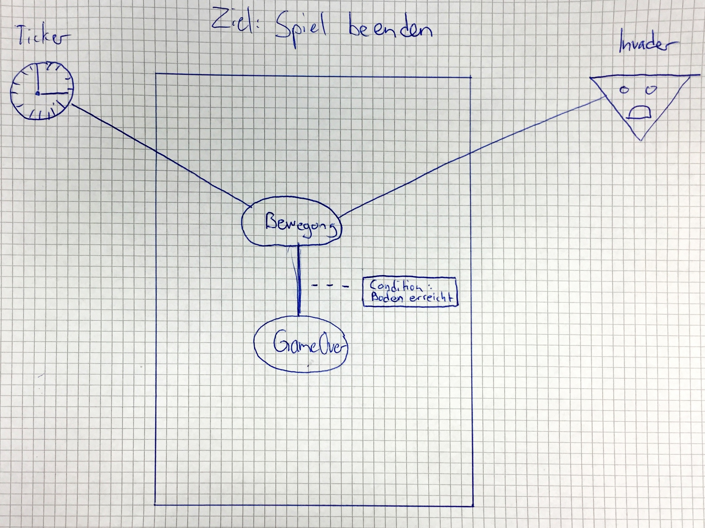

Dokumentation
=============
Alain Keller, Pascal Honegger und Seraphin Rihm
Version 1.3, 26.01.2016
:toc:

== Framework

=== C#
Wir werden C#6 / .Net 4.6.1 verwenden.

== Datenstruktur

=== Aufbau des Projektordner
Die Files werden in verschieden Ordnern unterteilt. Diese werden nach Überthemen des Projektes geordnet. Die Ordner sind doppelt vorhanden, einmal im SpaceInvaders und einmal im SpaceInvaders_Test Projekt.

== Continous Integration

link:https://ci.appveyor.com/project/PascalHonegger/spaceinvaders[AppVeyor]
unterstützt als einzige CI neben Travis C#, benötigt aber weniger Konfigurationen.

== VCS-Server
link:https://github.com/PascalHonegger/SpaceInvaders[Github]

== Pflichtenheft

=== SpaceInvaders Regeln

* Das Schiff
** Geschwindigkeit
** Grösse
** Aussehen
** Schuss

*** Der Invader
**** Gibt beim Tod verschiedene Punkte
**** Kann zurückschiessen
**** Kann sich nach links und rechts bewegen
**** Bewegt sich nach unten sobald eine Wand berührt
**** Hat verschiedene Schwierigkeiten
**** Hat anderes Aussehen

*** Der Spieler
**** Hat einen Benutzernamen
**** Hat eine gespeicherte Höchstpunktzahl
**** Kann zwischen verschiedenen Schiffen auswählen
**** Hat einen Schuss
**** Hat Leben (wie viele Schüsse bis zum Tod)
**** Hat Respawns (wie oft wieder auftauchen nach Tod)
**** Aussehen

* Der Schuss
** Geschwindigkeit
** Grösse
** Schaden
** Aussehen

* Der Boss
** Hat viele Leben
** Gibt viele Punkte
** Schiesst viele Schüsse zurück
** Ist grösser als ein normaler Invader

* Das Spielfeld
** Hat einen Spiel-starten Knopf
** Hat einen Spiel-beenden / neustarten Knopf, während das Spiel am Laufen ist
** Das Spiel endet, sobald der Spieler keine Leben mehr hat
** Zeigt den Benutzernamen, aktuelle Punktzahl und Höchstpunktzahl an
** Zeigt, in welcher Runde man sich befindet
** Zeigt eine Auswahl an Schiffen an

== Architektur
=== Usecase Beschreibung 
==== Bewegen (Spieler)
==== Beschreibung
Der Spieler möchte sein Schiff vertikal bewegen. Dies tut er über einen Pfeiltasten Input

===== Kategorie
Primär

===== Vorbedingungen
Spiel ist gestartet, Pfeiltaste gedrückt (rechts oder links), letzte Bewegung vor mindestens 0.2 sek.

===== Nachbedingung
Erfolg: Das Spielerschiff ist nach der Bewegung noch Komplet innerhalb des Spielfeldes.
Fehlschlag: Das Schiff ist nach der Bewegung ausserhalb des Spielfeldes.

===== Invarianten
Invaders

===== Akteuere
Spieler, Spielerschiff

===== Auslösendes Ereignis
Pfeiltaste wird gedrückt

===== Ablaufbeschreibung
* Spieler drückt rechte oder linke Pfeiltaste
* Das Schiff bewegt sich nach je nach Input in die jeweilige Richtung

==== Spiel beenden (aus sicht des Invaders)

===== Beschreibung
Der Invader möchte das Spiel beenden, indem er bis zum Boden gelangt. Dies tut er, indem er sich bewegt.

===== Kategorie
primär

===== Vorbedingungen
Spiel ist gestartet

===== Nachbedingung
Erfolgsfall: Spiel ist Game Over
Fehlschlag: Wave wurde zerstört

===== Invarianten
Spielerschiff

===== Akteuere
Invader

===== Auslösendes Ereignis
Spiel wird gestartet

===== Ablaufbeschreibung
* Invader bewegt sich horizontal, bis er eine Wand erreicht
* Dann bewegt er sich einmal vertikal nach unten
* Die obigen Schritte wiederholt er solange, bis er den Boden erreicht hat

== Tests
Wir haben unsere Klassen mit NUnit getestet. Folgende Klassen und Methoden sind getestet

* Schiffe
** Bei jedem Schiff ist die *Move* Methode getestet. Es wird sichergestellt, dass sich jedes Schiff korrekt bewegen kann.
** Die Properties *Lives* und *Health* werden direkt im Schiff verwaltet. So wird im Falle, dass die Health auf 0 fallen ein Lives abgezogen und die Leben erneut aufgefüllt.
* ViewModel
** Die Methode *DestroyEverything* ist getestet. Hinter diesem unscheinbaren Namen verbirgt sich die Logik, um die Variablen zurückzusetzen. Dies wird beispielsweise beim Beenden des Spiels aufgerufen, damit ein neues Spiel gestartet werden kann.
** Die Methode *IsOutOfBounds* ist ausführlich getestet. Diese Methode entscheided, wann ein Schiff oder Schuss das Spielfeld verlassen hat. Dies wird verwendet, um den Schuss beim Erreichen der Wand zu zerstören. Als auch um zu verhindern, dass ein Schiff aus dem Spielfeld fliegen könnte.
** Die Methode *FireShot* ist mit Mocks isoliert, welcher Schiffe und Schüsse testet. Diese Methode Sorgt dafür, dass ein Schuss des Schiffes geschossen wird. Diese Methode wird sowohl beim Spieler als auch beim Invader verwendet.
** Das Property *CurrentLives* wird im ViewModel getestet. So ist sichergestellt, dass wenn der Wert der jetzigen Leben auf 0 fällt, die Methode *GameOver* aufgerufen wird.

=== Fazit
Da unser Programm ausschliesslich über automatisierte Tests überprüft wird, ist es relativ einfach zu erkennen, ob das Programm sich in einem guten Zustand befindet. So kann man auf Github und auf link:https://ci.appveyor.com/project/PascalHonegger/spaceinvaders[AppVeyor] ansehen, ob die jetzige Version des Codes Fehler beinhaltet. Grundsätzlich kann man sagen, dass bereits ein fehlgeschlagener Unit-Test heisst, dass ein Kern-Feature nicht korrekt funktioniert.